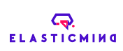
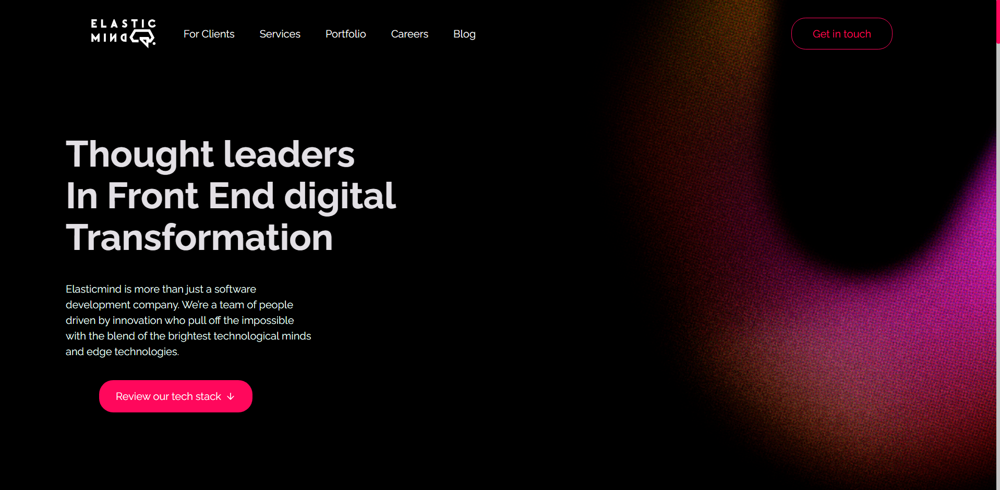

<p align='center'></p>

 <p align='center'>


  
</p>

## 🚀 Tecnologias

Esse projeto está utilizando as seguintes tecnologias:

- [Angular](https://react.dev/)
- [Next](https://nextjs.org/)
- [FeatherIcons](https://feathericons.com/)
- [FramerMotion](https://www.framer.com/motion/)
- [FramerMotion](https://www.framer.com/motion/)
- [Swiper](https://swiperjs.com/react)

## 📜 Descrição

Esse é o projeto oficial da Elasticmind, seu objetivo é trazer clareza sobre os objetivos da empresa, demonstrando
nosso potencial e casos de sucesso para gerar confiança aos clientes.

## 🎲 Como acessar o projeto?

### Clone esse repositório

```bash
git clone https://github.com/elasticmind-io/elasticmind.git
```

### Navegue até o diretório do projeto

```bash
cd elasticmind
```

### Instale as dependências

```bash
npm i
```

```bash
yarn
```

### Inicie a aplicação

```bash
npm run dev
```

## 🖼️ Layout



---

<p>Criado com 💜 por <a href='https://github.com/Savio-Anjos/' target='_blank'>Sávio Anjos</a></p>
